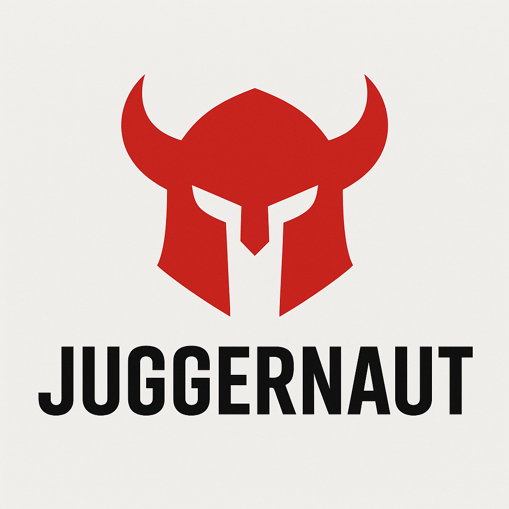

# ⚔️ **Juggernaut**

  

---
**The Ultimate Credential Cracking System**

---

## What is Juggernaut?

Juggernaut is a next-generation password cracking platform that outperforms traditional tools like John the Ripper and Hashcat by combining AI, hybrid hardware acceleration, and a cloud-native architecture.

---

## Key Selling Points & Advantages

- **AI-powered attack engine**: Learns from breached databases, generates context-specific rules, and combines brute-force, Markov, and smart mutations.
- **Hybrid, high-performance architecture**: Simultaneously leverages CPU (SIMD/AVX), GPU (CUDA/OpenCL), FPGA, and cloud resources.
- **Polymorphic cracking kernels**: Dynamically generates and dispatches optimized code for each hash type and device.
- **Dynamic load balancing**: Smart scheduler distributes work across all available hardware, including cloud.
- **Cloud-native & distributed**: Offload jobs to AWS Lambda, GCP Functions, or other cloud platforms for massive scale.
- **Universal hash support**: Auto-detects 150+ hash types, including blockchain and biometrics.
- **Smart resume**: State saved every 5s, survives crashes and power-offs.
- **Stealth/OpSec features**: TOR integration, memory-only execution, zero-disk, decoy traffic, covert packet scheduling.
- **Ethical use & auditability**: Enforces restricted, ethical use with license acknowledgment and cryptographically signed logs.
- **Extensible & modular**: Easy to add new hash algorithms, attack modes, or hardware/cloud backends.

---

## Feature Comparison

| Feature             | John the Ripper | Hashcat | Juggernaut |
|---------------------|-----------------|---------|------------|
| **AI-Guided Attacks**   | ❌              | ❌      | ✅         |
| **Multi-Cloud Support** | ❌              | ❌      | ✅         |
| **Live Hash Learning**  | ❌              | ❌      | ✅         |
| **Polymorphic Kernels** | ❌              | ❌      | ✅         |
| **Biometric Cracking**  | ❌              | ❌      | ✅         |
| **Zero-Disk Operation** | ❌              | ❌      | ✅         |

---

## Areas of Use

- **Cybersecurity & Red Teaming**: Credential audit, password strength testing, real-world attack simulation.
- **Academic & Security Research**: Password security studies, hash algorithm benchmarking, attack methodology research.
- **Incident Response & Forensics**: Rapid hash recovery for breach investigations, automated analysis of leaked credentials.
- **Cloud-Scale Cracking**: Bursting to cloud for large-scale, time-sensitive jobs; serverless workflows.
- **Enterprise Security Operations**: Continuous credential hygiene monitoring, SIEM/SOAR integration.

---

## Ethical Implementation

- **Restricted Ethical Use Only**: For cybersecurity professionals, red teamers, and academic researchers.
- **Audit Logging**: Cryptographically signed logs, automatic abuse detection, sandboxing for unauthorized use.
- **License**: See `config/ethics_policy.yml` and `LICENSE` for details.

---

## Project Structure

```
juggernaut/
├── core/                     # Core cracking engine
│   ├── cpu/                  # CPU kernels (SIMD/AVX)
│   ├── gpu/                  # GPU acceleration
│   ├── fpga/                 # FPGA bitstreams + Go driver
│   ├── hash_algorithms.c     # Hash algorithm dispatcher
│   └── scheduler.c           # Task scheduler and hardware orchestrator
├── ai_engine/                # AI/ML attack strategies (Python)
├── cloud/                    # Cloud-native components (Go, shell)
├── cli/                      # Command-line interface (C)
├── config/                   # Config files (YAML, TOML)
├── docs/                     # Documentation
├── tests/                    # Unit + benchmark tests
├── scripts/                  # Utility scripts
├── CONTRIBUTING.md
├── LICENSE
└── README.md
```

---

## Build & Usage

See `docs/manual.md` and `scripts/install.sh` for build and usage instructions.

---

## Want to Contribute?

We’re looking for contributors in:
- FPGA kernel optimization
- AI/ML attack model improvements
- Ethical usage policy design

Start with [`CONTRIBUTING.md`](CONTRIBUTING.md)

---

## 👮 License

Juggernaut is licensed under a **Restricted Ethical Use License**. Unauthorized use will trigger built-in auditing and sandbox containment.

See `LICENSE` and `config/ethics_policy.yml` for details.
