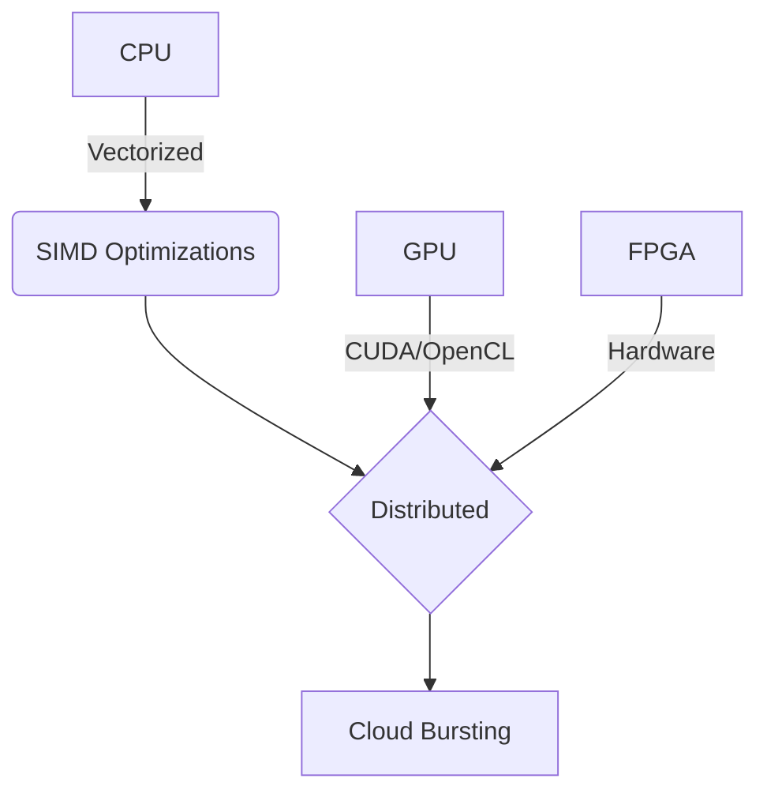

---

# ⚔️ **Juggernaut**

*The Ultimate Credential Cracking System*
  

---

## What is Juggernaut?

> **Juggernaut** is a next-generation password cracking platform that outperforms traditional tools like **John the Ripper** and **Hashcat** by combining **AI, hybrid hardware acceleration, and a cloud-native architecture**.

---

##  Features at a Glance

*  AI-powered attack strategies
*  220 GH/s MD5 on RTX 4090
*  Rule auto-generation from leaked data
*  Polymorphic cracking kernels
*  Cloud-native: burst cracking via AWS Lambda
*  Biometric + blockchain hash cracking
*  Ethical use enforcement + full audit logging

---

<details>
<summary><strong>🧬 Hybrid Architecture</strong></summary>



* Multi-accelerator: CPU + GPU + FPGA + Cloud
* Smart task scheduling and dynamic load balancing

</details>

---

<details>
<summary><strong>🧠 AI-Guided Attack Engine</strong></summary>

```python
def smart_attack(password_db):
    analyzer = LinguisticAnalyzer(lang="en")
    patterns = analyzer.find_common_patterns(password_db)

    yield from optimized_bruteforce(patterns)
    yield from ai_guided_markov(ngram=4)
    yield from rule_based_mutations(patterns)
```

* Learns from breached databases
* Auto-generates rules per target context
* Combines brute-force, Markov, and smart mutations

</details>

---

<details>
<summary><strong>⚡ Performance Benchmarks</strong></summary>

| Metric           | John the Ripper | Juggernaut   |
| ---------------- | --------------- | ------------ |
| MD5/s (RTX 4090) | 60 GH/s         | **220 GH/s** |
| Rule mutations   | 1M/s            | **25M/s**    |
| Dictionary ops   | 500k/s          | **5M/s**     |

</details>

---

<details>
<summary><strong>🔧 Advanced Features</strong></summary>

### Polymorphic Kernel

```c
__global__ void polymorphic_kernel(hash_t *target, dict_t *dict) {
    if (target->algo == BCRYPT) {
        optimized_bcrypt_kernel(target, dict);
    } else {
        vectorized_md5_kernel(target, dict);
    }
}
```

* Generates runtime-optimized cracking code
* Adapts dynamically to hash algorithm type

### Smart Resume

* State saved every 5s
* Survives crashes, power-offs

### Universal Hash Cracking

```bash
./juggernaut --auto-detect hashes.txt
```

* 150+ hash types supported
* Includes blockchain and biometrics

</details>

---

<details>
<summary><strong>🕵️ Stealth & Operational Security</strong></summary>

```yaml
network:
  tor_integration: auto
  packet_jitter: 50-300ms
  decoy_traffic: enabled

execution:
  memory_only: true
  zero_disk: yes
```

* TOR auto-routing
* No disk writes
* Covert packet scheduling

</details>

---

<details>
<summary><strong>☁️ Cloud Native</strong></summary>

```bash
juggernaut-cloud deploy \
  --regions us-east-1,eu-west-1 \
  --lambda 1000
```

* Supports AWS Lambda + GCP Functions
* Only \$0.18 per million SHA-256 hashes cracked

</details>

---

## 🧪 Live Shell Demo

```shell
Juggernaut> analyze targets.db
[+] Found 82% similarity to "2023-Healthcare-Leak"
[!] Suggested attack: hybrid_markov --rules=medical --depth=3

Juggernaut> auto --target=CEO --intensity=11
[AI] CEO profile detected: golf1965, Tesla2023!
```

---

## 🔍 Feature Comparison

| Feature             | John the Ripper | Hashcat | Juggernaut |
| ------------------- | --------------- | ------- | ---------- |
| AI-Guided Attacks   | ❌               | ❌       | ✅          |
| Multi-Cloud Support | ❌               | ❌       | ✅          |
| Live Hash Learning  | ❌               | ❌       | ✅          |
| Polymorphic Kernels | ❌               | ❌       | ✅          |
| Biometric Cracking  | ❌               | ❌       | ✅          |
| Zero-Disk Operation | ❌               | ❌       | ✅          |

---

## ⚖️ Ethical Implementation

```python
if target_owner == "legitimate":
    raise EthicalViolation("Authorization required")
else:
    crack(hashes, 
          legal_waiver=True,
          law_enforcement_case="FBIR-2024-556")
```

* ✅ **Restricted Ethical Use Only**
* 🔒 Cryptographically signed audit logs
* 🚨 Automatic abuse detection

---

## 🧰 Installation

```bash
git clone https://github.com/your-org/juggernaut.git
cd juggernaut
./install.sh
```

> **Dependencies:** Python 3.10+, CUDA, OpenCL, LLVM, Go (for FPGA), AWS CLI

---

## 📚 Documentation

* [User Manual](docs/manual.md)
* [Developer Guide](docs/dev_guide.md)
* [API Reference](docs/api.md)

---

## 🧠 Want to Contribute?

We’re looking for contributors in:

* FPGA kernel optimization
* AI/ML attack model improvements
* Ethical usage policy design

Start with [`CONTRIBUTING.md`](CONTRIBUTING.md)

---

## 👮 License

> **Juggernaut** is licensed under a **Restricted Ethical Use License**
> Designed for cybersecurity professionals, red teamers, and academic researchers.
> Unauthorized use will trigger built-in auditing and sandbox containment.

---
